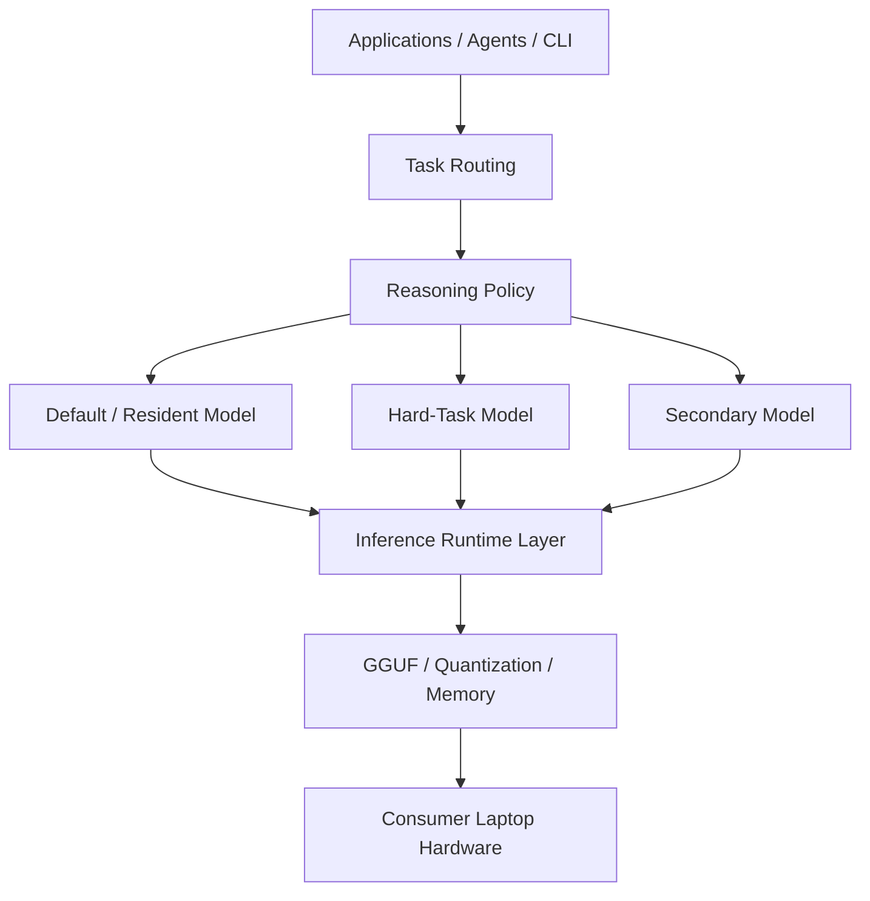

# The Fastest, Strongest Local AI Stack I Could Build on My Laptop

> How far can a consumer laptop push local AI if I optimize the whole stack
> instead of just downloading a model?

I started with a simple goal: run the strongest local AI I could tolerate
using **every day** — not a leaderboard winner, not a server-farm demo, but a
model stack that stays resident, answers reliably, and doesn't burn my whole
afternoon on a single prompt.

That goal turned into a full-stack engineering project:

- hardware reality and memory limits of an 8 GB VRAM laptop
- inference-runtime tuning (`llama.cpp`, then `FreeToken` on the same GGUF files)
- a **~10x** decoding-speed finding from moving MoE experts to CPU
- a real runtime bug, diagnosed and reported upstream
- a second bug so specific it produced a submitted, tested open-source patch
- a six-model, blind, 192-request reasoning-budget arena
- and finally a multi-model deployment stack I actually kept

> **The best local model turned out not to be a model at all — it was a stack.**

Model weights + quantization + inference runtime + memory behavior + reasoning
policy + evaluation harness + deployment role — together these decide the
result, not any single checkpoint. The arena I built proved the ranking itself
can reshuffle when you change only the reasoning policy.

---

## 01. The Goal

Not "find the strongest model". The goal was a **long-lived resident local AI**
scored on the dimensions that actually matter for daily use:

- answer quality
- delivery reliability (does the final answer arrive at all?)
- reasoning behavior
- latency / speed
- runtime stability
- memory behavior on 8 GB VRAM + 32 GB RAM
- compatibility with the runtime
- task role in the final stack

So "strongest" here is deliberately scoped: **the best practical stack for
this specific laptop and this specific workflow** — the *I Could Build* and
*on My Laptop* parts of the title are the point, not marketing. This is not a
claim of any global or universal best.

## 02. The Machine

A plain consumer laptop. Nothing exotic:

| | |
|---|---|
| **CPU** | Intel Core Ultra 9 275HX (24 cores) |
| **GPU** | NVIDIA GeForce RTX 5060 Laptop, **8 GB VRAM** (8151 MiB), sm_120 |
| **RAM** | 32 GB DDR5 (2 × 16 GB, 5600 MHz) |
| **Storage** | 1 TB NVMe SSD (measured ~2158 MB/s read) |
| **OS** | Windows 11, Build 26200 |
| **Runtime** | llama.cpp `b10375` (`ba360efe1`) and FreeToken 0.1.x |

*Source: local machine audit (2026-08-13) and the arena runtime-config records.*

8 GB VRAM sounds small for 35B-class local models — because it is. The whole
project is the story of working around exactly that: 32 GB system RAM, CPU
offload, MoE activation sparsity, Q4_K_M quantization, and runtime choices
that turn a 4 t/s curiosity into a 43+ t/s daily driver.

## 03. The Stack

The final deployment decision (maintainer decision, grounded in the arena
results below):

| role | model | why |
|---|---|---|
| **Default / resident** | Ornith-1.5-35B-A3B-Abliterated (Q4_K_M) | #1 overall in the native-thinking condition (Formal D, 569.5/800); runs fast and VRAM-light (43.5 t/s, ~3.5 GB) |
| **Hard tasks** | Nex-N2-mini (Q4_K_M) | #1 overall in the fixed-4096-reasoning-budget condition (Formal C, 746.5/800); biggest score jump (+393.5) when the budget forced completion |
| **Secondary / different lineage** | Gemma4-26B-A4B (Q4_K_M) | different base lineage and multimodal projector; was the long-running production resident before the arena |

*Roles above are the maintainer's deployment decision. The underlying numbers
are measured and published in the arena (section 08).*

## 04. Why Runtime Matters

The single biggest performance discovery was a **runtime configuration**, not a
new model.

On the same GPU, same llama.cpp, same `35B-A3B Q4_K_M` GGUF
(18.23 GiB), from the archived `llama-bench` records:

| configuration | tg64 decode |
|---|---|
| `ngl=99`, MoE experts on GPU | **4.15 t/s** |
| `ngl=99`, `n_cpu_moe=256` (experts on CPU) | **43.31 t/s** |

A ~**10x** speedup from moving the MoE experts to CPU. The 35B-A3B files do
not fit in 8 GB VRAM; with attention/dense layers on GPU and the sparse expert
activation computed on CPU (24 cores, ~77 GB/s memory bandwidth), the model
becomes a usable daily driver. Every arena speed number is therefore
**runtime-specific** and never compared against numbers from a different
runtime.

## 05. When the Stack Broke

The earlier 35B serving path ran through **FreeToken** (an independent
torch-based inference engine, Apache-2.0, FlashML-org). On Windows + CUDA 13,
loading a Qwen3.6-35B-A3B GGUF worked — prefill fine, API fine — but decode
produced only **2 tokens (`"user"`) and stopped**, every time.

Diagnosis (2026-08-24 → 08-26), verified by a controlled reproduction:

- root cause: the `untied lm_head` branch in the qwen3.5-moe GGUF loader
  returned logits for **all positions** during prefill, while the engine
  contract samples from the **last position** — so the first generated token
  was sampled from position 0, replaying the template.
- fix validated locally (prefill slicing on `lm_head`), reported to
  FlashML-org/FreeToken PR #131; the author reproduced it and confirmed the
  diagnosis was right, fixing it upstream (`b2f8475`).
- a second issue (MoE CUDA grid `z` dimension capped at 65535, crashing long
  prefills) was also fixed upstream (`9952a39`).

That bug report is the moment "benchmarking" stopped being about scores.

## 06. When Benchmarking Turned Into Debugging

FreeToken could not run **Ornith** at all: its GGUF expert-bank loader rejects
mixed-quant checkpoints (`Q4_K`/`Q6_K` banks mixed across layers), which is
exactly what llama.cpp's `Q4_K_M` produces. So Ornith stayed on llama.cpp
(43.5 t/s, long-prefill healthy), and FreeToken remained a separate runtime
path for uniform-quant models.

While validating lucaspirola's Ornith branch
(FlashML-org/FreeToken **PR #196**, `ornith-sm120-gguf-mmq-phase2`) on this
exact GPU, I found the auto pageable-GPU residency planner could not size
mixed-GGUF expert banks: `bank_bytes_estimate()` returned `None`, so split
residency planning was silently skipped.

I implemented and validated a fix — a shared `expert_bank_geometry()` helper
plus a `"gguf"` branch in the estimator — and **submitted it as a pull request**:

> [lucaspirola/FreeToken **#1**](https://github.com/lucaspirola/FreeToken/pull/1)
> — `fix(moe): size mixed-GGUF expert banks from GGUF metadata`
> (state at last check: **open**, not merged)

Verified against the patch:

- **+163 / −17** lines across 5 files, 8 CPU/synthetic regression tests
- Ornith Q4_K_M geometry: gate/up stride `1,179,648` B, down stride `860,160` B,
  logical bank size `522,190,848` B/layer → `20,887,633,920` B total (40 layers),
  estimator delta **0**
- end-to-end on this laptop: 15 GiB pin budget → 10 pageable + 30 pinned MoE
  layers, **60/60** host registrations, **14.589844 GiB** cumulatively
  registered, `/health = ready`, HTTP 200

*I am the external validator/debugger/patch author of that stacked PR — not the
author of PR #196. The wording above reflects the PR's actual GitHub state
(`merged_at: null`).*

## 07. Choosing the Models

Six local GGUF models, all Q4_K_M, all runnable on this laptop via llama.cpp
`b10375`:

| model | file size | arch |
|---|---|---|
| Ornith-1.5-35B-A3B-Abliterated | 19.71 GB | qwen35moe (256 exp) |
| Nex-N2-mini | 19.92 GB | qwen35moe (256 exp) |
| Gemma4-26B-A4B-QAT-Uncensored-Balanced | 15.64 GB | gemma4 (128 exp) |
| RavenX-CyberAgent-35B-v5.1 | 20.22 GB | qwen35moe (256 exp) |
| Endy-Qwen3.6-CyberSec-35B-A3B | 20.22 GB | qwen35moe (256 exp) |
| Qwen3.8-9B-abliterated-25 | 5.24 GB | 9B dense |

Measured decoding speeds (llama.cpp b10375, experts-on-CPU config, the arena's
speed gate was ≥10 t/s, all passed):

| model | gen t/s |
|---|---:|
| Qwen3.8-9B-abliterated-25 | 58.2 |
| Nex-N2-mini | 47.0 |
| Endy-Qwen3.6-CyberSec | 45.2 |
| RavenX-CyberAgent-35B | 44.8 |
| Ornith-1.5-35B-A3B | 43.5 |
| Gemma4-26B-A4B | 37.7 |

*Sources: model inventory + performance records (local arena workspace).*

## 08. The Reasoning Budget Arena

To compare them fairly, I built a controlled-ish, blind, six-model arena:
**32 frozen questions** (18 general + 14 cyber), **192 requests**, one
llama.cpp server at a time, `ctx=8192`, `max_tokens=8192`, `temperature=0.1`,
`top_p=0.9`, no system prompt, identical runtime for every model. Two
conditions on the same question set:

- **Formal D** — native/default thinking, no reasoning budget
- **Formal C** — native thinking + hard `--reasoning-budget 4096`

Blind final-only grading: scores were locked before identities were revealed.

Key structural metrics (verified, published):

| | Formal D | Formal C |
|---|---|---|
| records | 192 | 192 |
| non-empty final answers | 119 (61.98%) | 192 (100%) |
| empty finals | 73 | 0 |
| context-exhausted | 77 | 8 |
| confirmed loops | 0 | 6 |
| structurally clean finals | 115 | 184 (95.8%) |

Overall blind scores (/800):

| model | D | C | Δ | rank D→C |
|---|---:|---:|---:|---|
| Ornith-1.5-35B-A3B | **569.5** | 725.5 | +156.0 | 1→2 |
| Nex-N2-mini | 353.0 | **746.5** | **+393.5** | 4→**1** |
| Gemma4-26B-A4B | 540.5 | 706.0 | +165.5 | 2→3 |
| Endy-Qwen3.6-CyberSec | 526.0 | 644.0 | +118.0 | 3→4 |
| Qwen3.8-9B-abliterated | 332.5 | 635.0 | +302.5 | 5→5 |
| RavenX-CyberAgent-35B | 301.5 | 576.0 | +274.5 | 6→6 |

The full evidence — methodology, scores, rankings, structural metrics, model
fingerprints, figures, limitations, reproducibility — is the **published
Reasoning Budget Arena** repository:

- repo: <https://github.com/zyy0212time-del/reasoning-budget-arena>
- v1.0.0: <https://github.com/zyy0212time-del/reasoning-budget-arena/releases/tag/v1.0.0>

This project is the engineering story; the arena is the research evidence.

## 09. The Weirdest Result

Changing **only** the reasoning policy reshuffled the ranking:

- Formal C produced **0 empty final answers** where Formal D had 73.
- Every model scored higher under the fixed budget; the largest jump was
  Nex **+393.5**, moving it from rank 4 to rank 1.
- But two of the next-largest jumps (Qwen 9B +302.5, RavenX +274.5) changed
  **no** ranks — those models were also furthest behind.
- The failure mode did not disappear; it **shifted**: 73 empty finals became
  6 content-channel loops + 2 context-truncated answers.

Two takeaways shaped the final stack: (1) **no single ranking survives a
policy change** — "Ornith is strongest" would be wrong even one experiment
later; (2) a hard reasoning budget is a real delivery lever, and the model
that benefits most (Nex) earns a role in the stack.

## 10. The Final Stack

The deployment is a **three-model stack behind one routing layer**, on
llama.cpp (`llama-server`), which replaced the previous single-resident
setup (Gemma4-26B had been the system's only resident model):

- **Ornith** — default / resident model for everyday conversation and general
  work (Formal D winner; fast, VRAM-light, reliable under native thinking).
- **Nex** — routed to hard tasks where completion is critical (Formal C
  winner under the fixed 4096 budget).
- **Gemma4-26B** — secondary model from a different lineage (and multimodal),
  kept for compatibility/vision roles.

Reasoning policy is part of the stack: native thinking by default, with the
fixed-budget mode available as a delivery lever for tasks that need a final
answer every time. (Deployment decision by the maintainer; runtime behavior
measured and documented in the arena.)

## 11. What I Learned

1. **On a consumer laptop, the runtime decides more than the checkpoint.**
   ~10x from `n_cpu_moe`; 4.15 → 43.31 t/s on the same file.
2. **Rankings are policy-dependent.** A one-line server flag reshuffled a
   six-model leaderboard.
3. **Delivery is a first-class metric.** "Best quality, 38% empty answers" is
   not a daily driver; the budget condition that forced completion scored
   highest overall.
4. **Debugging is part of benchmarking.** The same GGUF that ran perfectly in
   llama.cpp broke decode in another runtime; the fix started as a bug report
   and ended as a submitted OSS patch.
5. **"Strongest" only means something scoped to a machine and a workflow.**
   8 GB VRAM, 32 GB RAM, and your actual usage are the real benchmark
   hardware.

## 12. Reproduce / Explore

This repo is the story and the system design. The reproducible experiment —
questions, harness configs, objective/audit scripts, score validation, and
figures — lives in the **Reasoning Budget Arena** repository:

- <https://github.com/zyy0212time-del/reasoning-budget-arena>

Key local evidence archived alongside this project:

- `docs/RUNTIME-EVIDENCE.md` — hardware audit, llama-bench records,
  FreeToken backend A/B numbers, model fingerprints
- `docs/ARENA-REFERENCE.md` — the verified Formal D/C numbers and links
- `docs/FREETOKEN-OSS-STORY.md` — the two bug stories and the PR #1 state
- `docs/DEPLOYMENT-STACK.md` — ports, launcher slots, runtime configs

The arena repo's `REPRODUCIBILITY.md` documents the clean-room path tests and
the exact runtime contract (llama.cpp b10375, experts-on-CPU).

## 13. Related Work / Links

- Reasoning Budget Arena (published evidence): <https://github.com/zyy0212time-del/reasoning-budget-arena>
- FlashML-org/FreeToken PR #196 (lucaspirola's Ornith branch): <https://github.com/FlashML-org/FreeToken/pull/196>
- My patch — lucaspirola/FreeToken PR #1: <https://github.com/lucaspirola/FreeToken/pull/1>
- FlashML-org/FreeToken PR #131 (generic-GGUF qwen35moe support; the decode
  bug was reported there): <https://github.com/FlashML-org/FreeToken/pull/131>
- llama.cpp: <https://github.com/ggml-org/llama.cpp>

## 14. License / Attribution

- Code in this repository: **MIT** (see `LICENSE`).
- Documentation, diagrams, and project-authored narrative in this repository:
  **CC BY 4.0** (see `LICENSE-DOCS-DATA.md`).
- Model weights and names belong to their upstream authors (see `NOTICE.md`);
  no model weights are distributed here. The arena's scores and data are the
  Reasoning Budget Arena's own project-authored evidence, published under its
  license.
