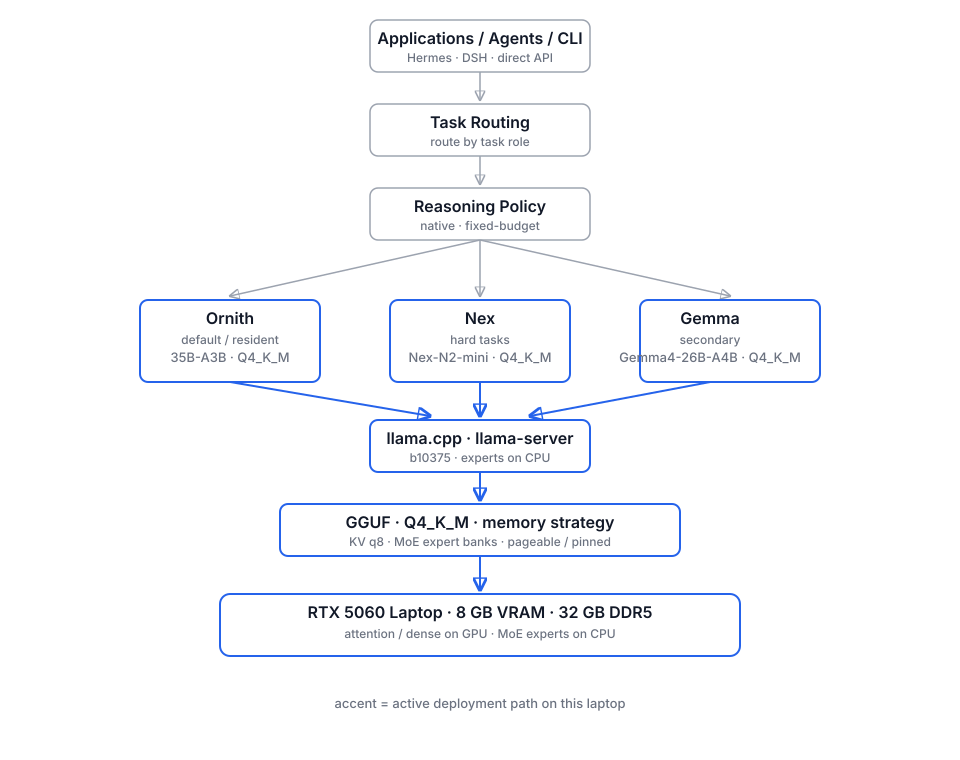

# The Fastest, Strongest Local AI Stack I Could Build on My Laptop

> How far can a consumer laptop push local AI if I optimize the whole stack
> instead of just downloading a model?

I set out to run the strongest local AI I could tolerate using **every day** —
a resident stack, not a leaderboard chase. That became a full-stack project:
runtime tuning, memory limits, a real runtime bug, an open-source patch, a
six-model blind evaluation, and finally a deployment stack I actually kept.

| at a glance | |
|---|---|
| **machine** | RTX 5060 Laptop · 8 GB VRAM · 32 GB DDR5 |
| **runtime discovery** | 4.15 → 43.31 t/s (same GGUF, experts on CPU) |
| **research** | 6 models × 32 frozen questions × 2 conditions · 384 responses |
| **final stack** | Ornith (default) · Nex (hard tasks) · Gemma (secondary) |

> **The best local model turned out not to be a model at all — it was a stack.**

Model weights + quantization + inference runtime + memory behavior + reasoning
policy + evaluation harness + deployment role together decide the result — not
any single checkpoint.

---

## 01. The Goal

Not "find the strongest model". The goal was a **long-lived resident local AI**
scored on what matters for daily use: answer quality, delivery reliability,
reasoning behavior, latency, runtime stability, memory behavior, runtime
compatibility, and task role.

"Strongest" here is deliberately scoped: **the best practical stack for this
specific laptop and this specific workflow**. The *I Could Build* and
*on My Laptop* parts of the title are the point — this is not a claim of any
global or universal best.

## 02. The Machine

A plain consumer laptop. Nothing exotic:

| | |
|---|---|
| **CPU** | Intel Core Ultra 9 275HX (24 cores) |
| **GPU** | NVIDIA GeForce RTX 5060 Laptop, **8 GB VRAM** (8151 MiB), sm_120 |
| **RAM** | 32 GB DDR5 (2 × 16 GB, 5600 MHz) |
| **Storage** | 1 TB NVMe SSD (measured ~2158 MB/s read) |
| **OS** | Windows 11, Build 26200 |
| **Runtime** | llama.cpp `b10375` (`ba360efe1`) and FreeToken 0.1.x |

*Source: local machine audit (2026-08-13) and the arena runtime-config records.*

8 GB VRAM sounds small for 35B-class local models — because it is. The whole
project is the story of working around exactly that: 32 GB system RAM, CPU
offload, MoE activation sparsity, Q4_K_M quantization, and runtime choices
that turn a 4 t/s curiosity into a 43+ t/s daily driver.

## 03. The Stack

The final deployment (maintainer decision, grounded in the arena results
below):

| role | model | why |
|---|---|---|
| **Default / resident** | Ornith-1.5-35B-A3B-Abliterated (Q4_K_M) | #1 overall in the native-thinking condition (Formal D, 569.5/800); fast and VRAM-light (43.5 t/s, ~3.5 GB) |
| **Hard tasks** | Nex-N2-mini (Q4_K_M) | #1 overall under the fixed-4096-reasoning-budget condition (Formal C, 746.5/800); largest observed score jump (+393.5) |
| **Secondary / different lineage** | Gemma4-26B-A4B (Q4_K_M) | different base lineage and multimodal projector; was the long-running production resident before the arena |

*Roles are the maintainer's deployment decision; the numbers are measured and
published in the arena (section 08).*

## 04. Why Runtime Matters

The single biggest performance discovery was a **runtime configuration**, not a
new model. On the same GPU, same llama.cpp, same `35B-A3B Q4_K_M` GGUF
(18.23 GiB), from the archived `llama-bench` records:

| configuration | tg64 decode |
|---|---|
| `ngl=99`, MoE experts on GPU | **4.15 t/s** |
| `ngl=99`, `n_cpu_moe=256` (experts on CPU) | **43.31 t/s** |

A ~**10x** speedup from moving the MoE experts to CPU. The 35B-A3B files do
not fit in 8 GB VRAM; with attention/dense layers on GPU and the sparse expert
activation computed on CPU (24 cores, ~77 GB/s memory bandwidth), the model
becomes a usable daily driver. Every arena speed number is therefore
**runtime-specific** and never compared against numbers from a different
runtime.

## 05. When the Stack Broke

The earlier 35B serving path ran through **FreeToken** (an independent
torch-based inference engine, Apache-2.0, FlashML-org). On Windows + CUDA 13,
loading a Qwen3.6-35B-A3B GGUF worked — prefill fine, API fine — but decode
produced only **2 tokens (`"user"`) and stopped**, every time.

Diagnosis (2026-08-24 → 08-26), verified by reproducing the failure:

- root cause: the `untied lm_head` branch in the qwen3.5-moe GGUF loader
  returned logits for **all positions** during prefill, while the engine
  contract samples from the **last position** — so the first generated token
  was sampled from position 0, replaying the template.
- fix validated locally (prefill slicing on `lm_head`), reported to
  FlashML-org/FreeToken PR #131; the author reproduced it, confirmed the
  diagnosis was right, and fixed it upstream (`b2f8475`).
- a second issue (MoE CUDA grid `z` dimension capped at 65535, crashing long
  prefills) was also fixed upstream (`9952a39`).

That bug report is the moment "benchmarking" stopped being about scores.

## 06. When Benchmarking Turned Into Debugging

The timeline matters here:

1. The earlier/main production FreeToken path **could not run the mixed-GGUF
   Ornith artifact** — its expert-bank loader rejects mixed-quant checkpoints
   (`Q4_K`/`Q6_K` banks across layers), exactly what llama.cpp's `Q4_K_M`
   produces. So Ornith stayed on llama.cpp (43.5 t/s, long-prefill healthy),
   and FreeToken remained a separate path for uniform-quant models.
2. **lucaspirola's experimental branch** (FlashML-org/FreeToken PR #196,
   `ornith-sm120-gguf-mmq-phase2`) added the sm_120/Ornith route — the first
   path that could actually validate Ornith in FreeToken.
3. Validating that branch on this exact GPU exposed a **separate** gap: the
   auto pageable-GPU residency planner could not size mixed-GGUF expert banks
   (`bank_bytes_estimate()` returned `None`), so split residency planning was
   silently skipped.
4. I implemented and validated a fix — a shared `expert_bank_geometry()`
   helper plus a `"gguf"` branch in the estimator — and **submitted it as a
   pull request**:

> [lucaspirola/FreeToken **#1**](https://github.com/lucaspirola/FreeToken/pull/1)
> — `fix(moe): size mixed-GGUF expert banks from GGUF metadata`
> (state at last check: **open**, not merged)

The patch is a single commit (+163/−17 across 5 files) with 8 CPU/synthetic
regression tests, validated by a laptop end-to-end load (60/60 host
registrations, `/health = ready`, HTTP 200). Exact bank geometry and validation
bytes are in [docs/FREETOKEN-OSS-STORY.md](docs/FREETOKEN-OSS-STORY.md) and
[docs/RUNTIME-EVIDENCE.md](docs/RUNTIME-EVIDENCE.md).

*I am the external validator/debugger/patch author of that stacked PR — not the
author of PR #196. The wording above reflects the PR's actual GitHub state
(`merged_at: null`).*

## 07. Choosing the Models

Six local GGUF models, all Q4_K_M, all runnable on this laptop via llama.cpp
`b10375`. Speeds below are measured on the experts-on-CPU config (runtime-
specific; all six passed the arena's ≥10 t/s gate):

| model | size | arch | gen t/s |
|---|---|---|---|
| Ornith-1.5-35B-A3B-Abliterated | 19.71 GB | qwen35moe (256) | 43.5 |
| Nex-N2-mini | 19.92 GB | qwen35moe (256) | 47.0 |
| Gemma4-26B-A4B-Balanced | 15.64 GB | gemma4 (128) | 37.7 |
| RavenX-CyberAgent-35B-v5.1 | 20.22 GB | qwen35moe (256) | 44.8 |
| Endy-Qwen3.6-CyberSec-35B-A3B | 20.22 GB | qwen35moe (256) | 45.2 |
| Qwen3.8-9B-abliterated-25 | 5.24 GB | 9B dense | 58.2 |

*Sources: model inventory + performance records (local arena workspace).*

## 08. The Reasoning Budget Arena

The evaluation behind this story is the published **Reasoning Budget Arena** —
an **exploratory, closely matched** comparison, **not a strict single-variable
controlled experiment**. Same six models, same final frozen 32-question
benchmark (18 general + 14 cyber), closely matched target settings
(`ctx=8192`, `max_tokens=8192`, `temperature=0.1`, `top_p=0.9`), one llama.cpp
server at a time, no system prompt.

- **Formal D** — native/default thinking. Its published baseline was a
  composite: a 29-question 8192 probe plus a later G1/G8/G10 supplement.
- **Formal C** — one complete 32-question run under a hard
  `--reasoning-budget 4096`.

The two execution histories were **not identical**. Blind final-only grading;
scores were locked before identities were revealed.

**192 requests per condition** — 384 model-question responses across
Formal D + Formal C.

Structural snapshot:

| | Formal D | Formal C |
|---|---|---|
| final answers | 119/192 | 192/192 |
| structurally clean finals | 115 | 184 |

Rank movement that matters: **Ornith #1 in Formal D** · **Nex #1 in Formal C**
(Nex: rank 4 → 1).

*Source: Reasoning Budget Arena v1.0.0, project-authored CC BY 4.0.*

Full score table, structural metrics, and the complete protocol:
[docs/ARENA-REFERENCE.md](docs/ARENA-REFERENCE.md) and the published
[Reasoning Budget Arena](https://github.com/zyy0212time-del/reasoning-budget-arena)
repository. This project is the engineering story; the arena is the research
evidence.

## 09. The Weirdest Result

Under the fixed-budget protocol, the **observed ranking looked very different**.
(Formal D and C are closely matched exploratory conditions, not
execution-identical runs — these are observations from this run, not an
isolated causal proof.)

- Formal C delivered non-empty finals in **192/192** responses; Formal D had
  **73 empty finals**.
- Every model's observed score was higher in Formal C; the largest delta was
  Nex **+393.5** (rank 4 → 1).
- Two of the next-largest deltas (Qwen 9B +302.5, RavenX +274.5) did not change
  that model's rank — both already sat furthest down the order.
- The observed failure profile differed: Formal D had 73 empty finals;
  Formal C had 6 confirmed content-channel loops and 2 context-truncated finals.

Two takeaways shaped the final stack: no ranking here should be read as
policy-independent, and a fixed reasoning budget is a real delivery lever on
this hardware.

## 10. The Final Stack

A benchmark is useful when it **changes what I deploy**. The arena did:

| Role | Model | Why it stayed |
|---|---|---|
| **Default** | Ornith | native-thinking balance · D #1 · ~43.5 t/s · ~3.5 GB VRAM |
| **Hard tasks** | Nex | C #1 under the fixed-budget protocol |
| **Secondary** | Gemma | alternate lineage · multimodal/fallback |

These sit behind one task-routing layer on llama.cpp (`llama-server`),
replacing the previous single-resident setup (Gemma4-26B had been the
system's only resident model). Reasoning policy is part of the stack: native
thinking by default, with the fixed-budget mode as a delivery lever for tasks
that need a final answer every time.

**Retired from the active stack:** RavenX-CyberAgent, Endy-Qwen3.6-CyberSec,
and Qwen3.8-9B-abliterated. They did not justify a permanent active role on
this laptop after the evaluation — a deployment decision, not a judgement of
their quality.

The arena changed four things in practice: **default-model selection,
hard-task routing, model retention, and storage/deployment decisions**.

## 11. What I Learned

1. **Runtime configuration can dominate practical throughput on constrained
   hardware.** ~10x from moving MoE experts to CPU: 4.15 → 43.31 t/s on the
   same file.
2. **The observed ranking differed substantially under the fixed-budget
   protocol.**
3. **Delivery is a first-class metric.** The fixed-budget condition delivered
   non-empty finals in 192/192 responses in this run, with a different failure
   profile — "best quality, 38% empty answers" is not a daily driver.
4. **Debugging is part of benchmarking.** The same GGUF that ran fine in
   llama.cpp broke decode in another runtime; the fix started as a bug report
   and ended as a submitted OSS patch.
5. **"Strongest" only means something scoped to a machine and a workflow.**
   8 GB VRAM, 32 GB RAM, and your actual usage are the real benchmark
   hardware.

## 12. Reproduce / Explore

This repo is the story and the system design. The reproducible experiment —
questions, harness configs, objective/audit scripts, score validation, and
figures — lives in the **Reasoning Budget Arena** repository:

- <https://github.com/zyy0212time-del/reasoning-budget-arena>

Technical detail archived alongside this project:

- `docs/RUNTIME-EVIDENCE.md` — hardware audit, llama-bench records,
  FreeToken backend A/B numbers, model fingerprints
- `docs/ARENA-REFERENCE.md` — full Formal D/C score table, structural metrics,
  links
- `docs/FREETOKEN-OSS-STORY.md` — the two bug stories and the PR #1 state,
  including exact patch geometry
- `docs/DEPLOYMENT-STACK.md` — ports, launcher slots, runtime configs

The arena repo's `REPRODUCIBILITY.md` documents the clean-room path tests and
the exact runtime contract (llama.cpp b10375, experts-on-CPU).

## 13. Related Work / Links

- Reasoning Budget Arena (published evidence): <https://github.com/zyy0212time-del/reasoning-budget-arena>
- FlashML-org/FreeToken PR #196 (lucaspirola's Ornith branch): <https://github.com/FlashML-org/FreeToken/pull/196>
- My patch — lucaspirola/FreeToken PR #1: <https://github.com/lucaspirola/FreeToken/pull/1>
- FlashML-org/FreeToken PR #131 (generic-GGUF qwen35moe support; the decode
  bug was reported there): <https://github.com/FlashML-org/FreeToken/pull/131>
- llama.cpp: <https://github.com/ggml-org/llama.cpp>

## 14. License / Attribution

- Code in this repository: **MIT** (see `LICENSE`).
- Documentation, diagrams, and project-authored narrative in this repository:
  **CC BY 4.0** (see `LICENSE-DOCS-DATA.md`).
- `assets/arena-rank-change.png` is a project-authored figure from the
  Reasoning Budget Arena v1.0.0 (CC BY 4.0); see `assets/ATTRIBUTION.md`.
- Model weights and names belong to their upstream authors (see `NOTICE.md`);
  no model weights are distributed here. The arena's scores and data are the
  Reasoning Budget Arena's own project-authored evidence, published under its
  license.
